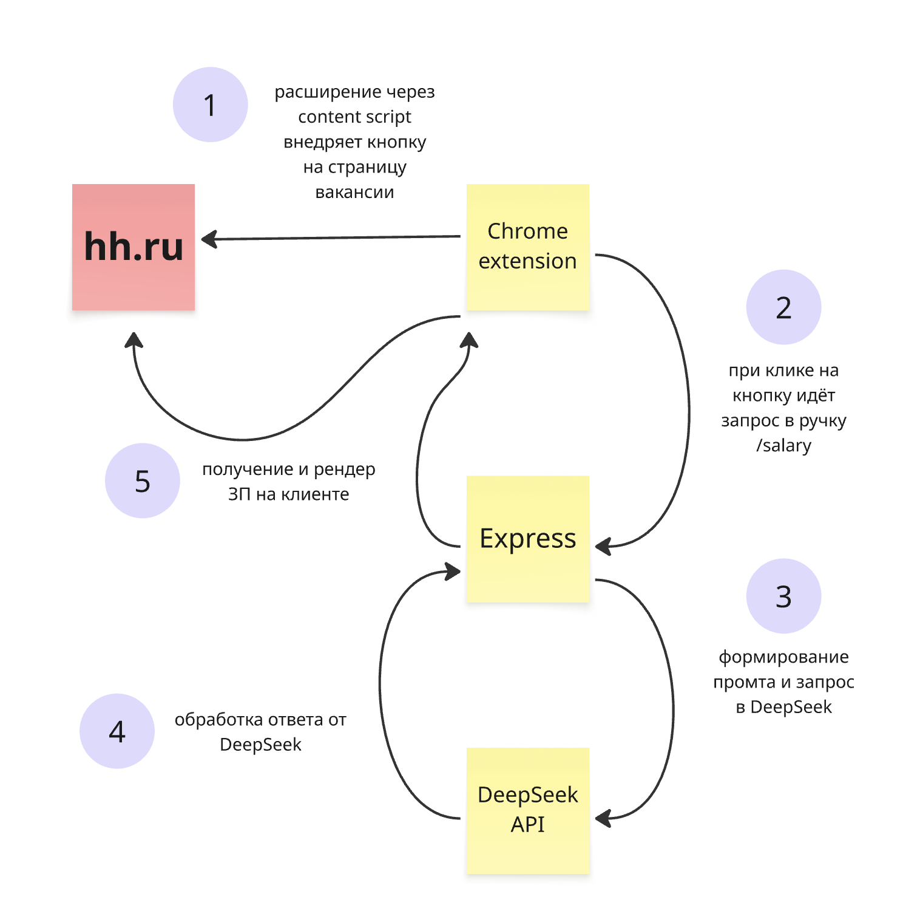
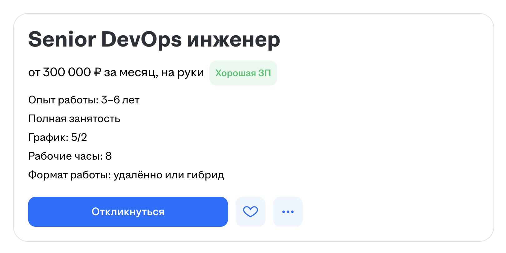
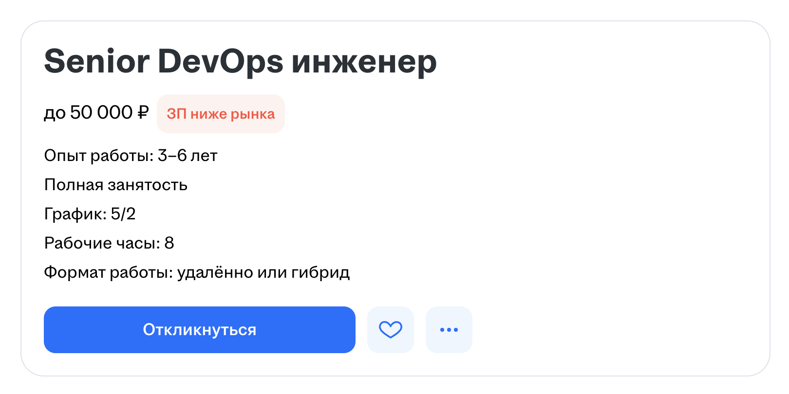

# ЗП Инсайдер 🤑

Мой проект для hh вайбатона. 99% кода умышленно написано с помощью нейросети. За качество отвечает **Claude Code**.

## Превью

## Проблема

- На hh.ru много вакансий без указания зарплаты
- Это печально
- Я подумал, что будет круто дать возможность соискателям посмотреть ЗП, даже если работодатель её не указал

## Решение

- Если на странице вакансии не указана зарплата, добавляем кнопку **"Узнать у нейросети"**
- По нажатию на кнопку отправляем запрос в нейросеть с заголовком вакансии
- Нейросеть анализирует вакансию и подсказывает для неё рыночную зарплату

## Архитектура

## Что можно улучшить

- Сделать нативную интеграцию без использования браузерного расширения
- Передавать в нейросеть больше контекста для точности прогнозируемой ЗП
  - город
  - требуемый опыт работы
  - уровень квалификации
  - и тд
- Интеграция с зарплатами из DreamJob
- Показывать инсайды о зарплате, даже когда она указана
  - плашка "Хорошая ЗП", если выше рыночной
  - в противном случае показывать плашку "ЗП ниже рынка"

